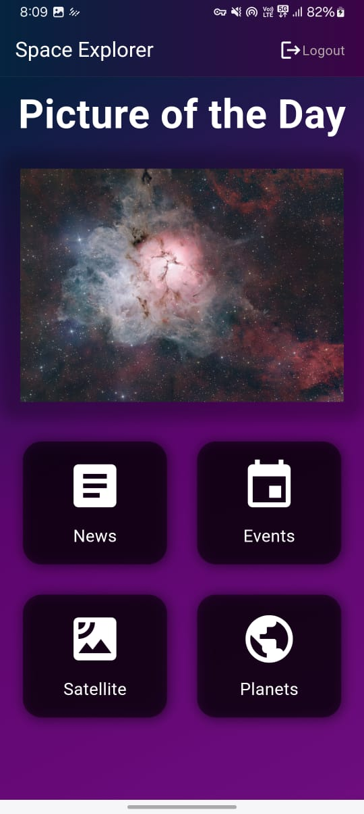
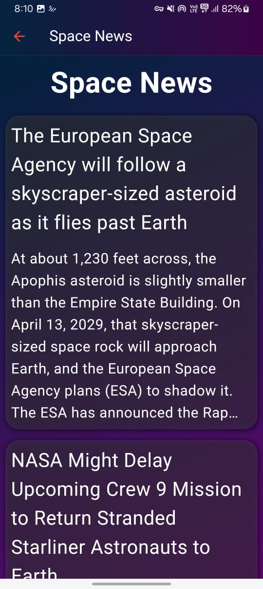
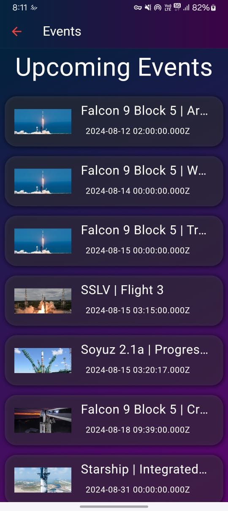
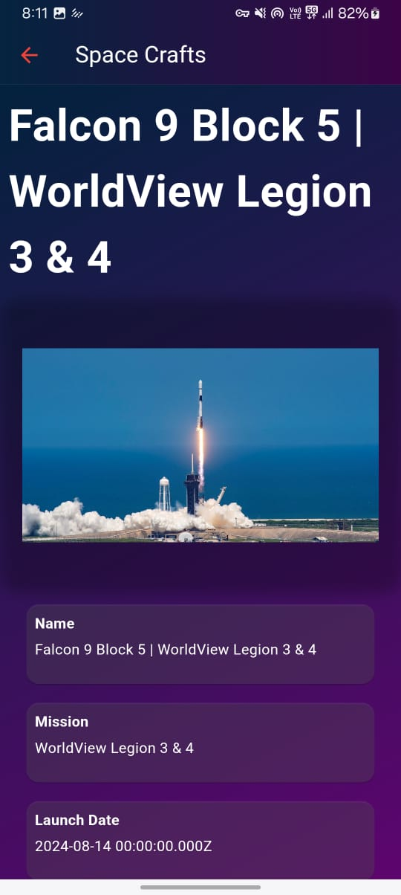
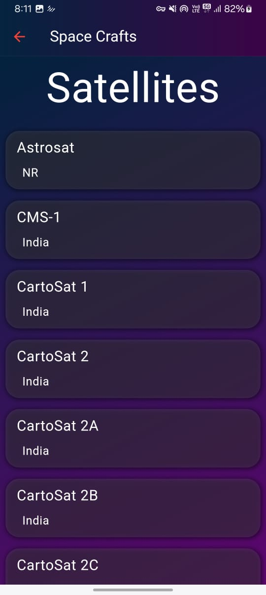
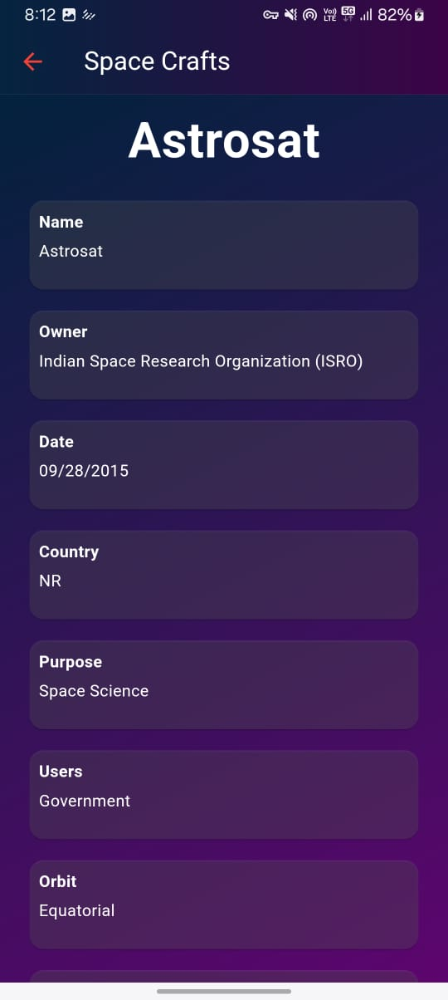
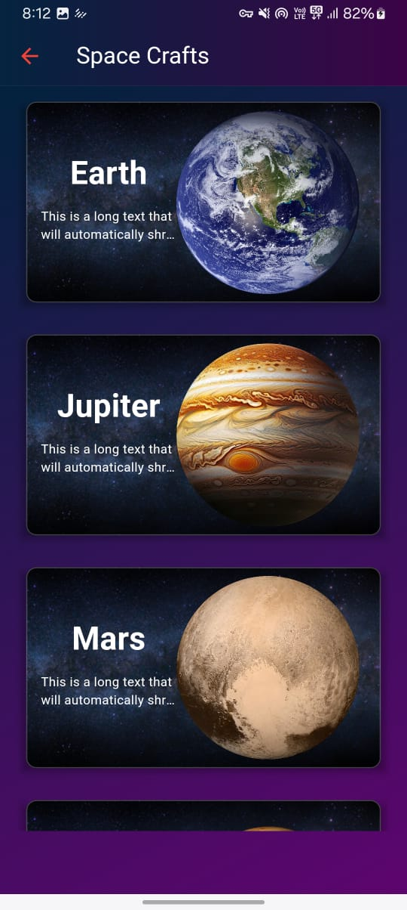
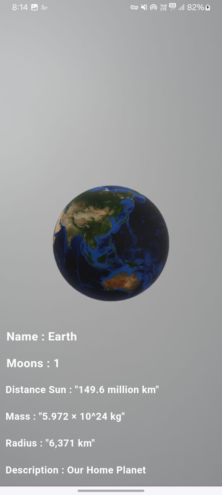
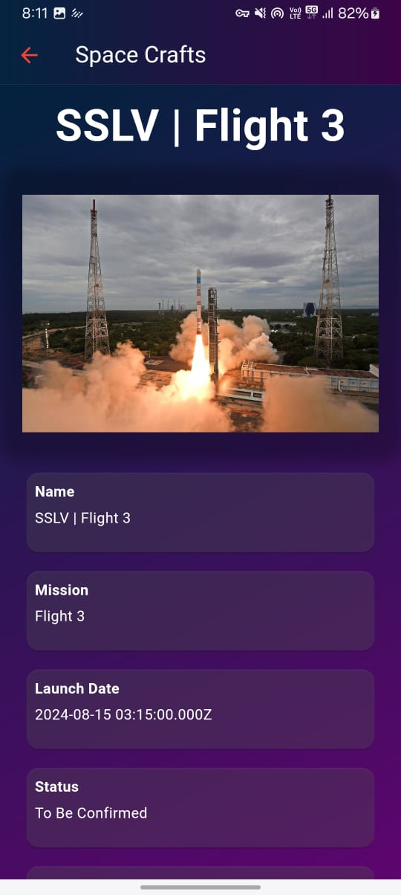

# Space Xplorer

The Space Explorer App is your ultimate gateway to the cosmos, providing you with all the latest information and insights related to space. Whether you're an avid space enthusiast, a student, or a professional in the field, this app brings the universe closer to your fingertips with the following key features:

Latest Space News: Stay informed with up-to-the-minute news on space exploration, discoveries, and research. The app curates the most significant stories from around the world, covering everything from groundbreaking studies to mission updates.

Upcoming Space Events: Never miss a moment in the world of space exploration with our comprehensive calendar of upcoming space-related events. From international conferences and launch events to stargazing nights and educational webinars, the app keeps you updated on what's happening in the space community globally.

ISRO Spacecraft and Satellites: Dive deep into the details of spacecraft and satellites launched by the Indian Space Research Organisation (ISRO). The app provides comprehensive data on each mission, including technical specifications, mission objectives, launch details, and outcomes.

Planetary Database: Explore the wonders of the universe with our extensive database of planets. Get detailed information on planets within our solar system and beyond, including their composition, atmosphere, orbit, and any missions associated with them.

## Prototype

Youtube Video Link : https://youtu.be/dsGAyjDlQeQ

 
 
 
 
 

 

 

